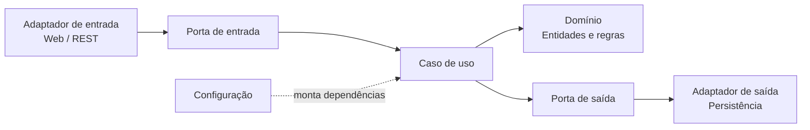
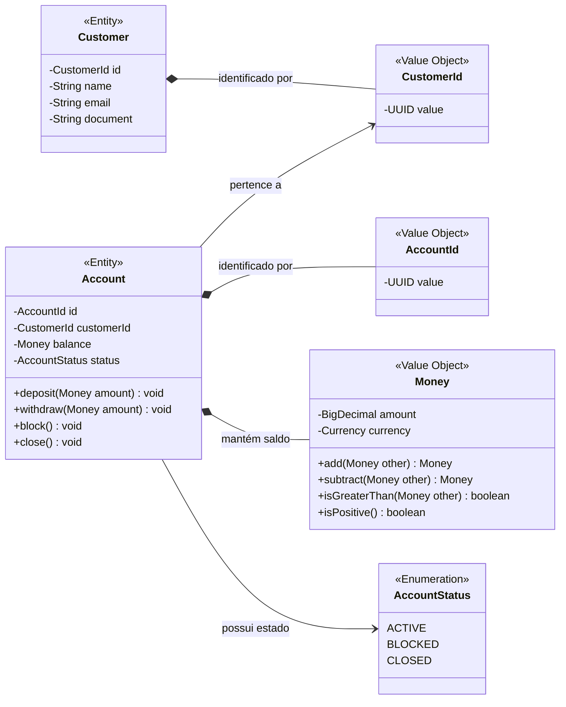

# Ledger Financeiro

Carteira digital focada em DDD, SOLID e arquitetura hexagonal.

## Primeiro recorte

`TransferirEntreContas` move saldo entre duas contas ativas, garantindo valor positivo, contas distintas, saldo suficiente, mesma moeda e lançamento contábil balanceado.

## Estrutura

- `domain`: regras de negócio sem dependência de framework.
- `application`: casos de uso e portas de entrada/saída.
- `adapter`: integrações HTTP, banco e mensageria (a implementar).

## Diagramas de referência

Os diagramas abaixo são somente material de estudo. Eles não representam código já criado no projeto.

### Arquitetura hexagonal



### Modelo de classes inicial



## Executar testes

```powershell
mvn test
```
